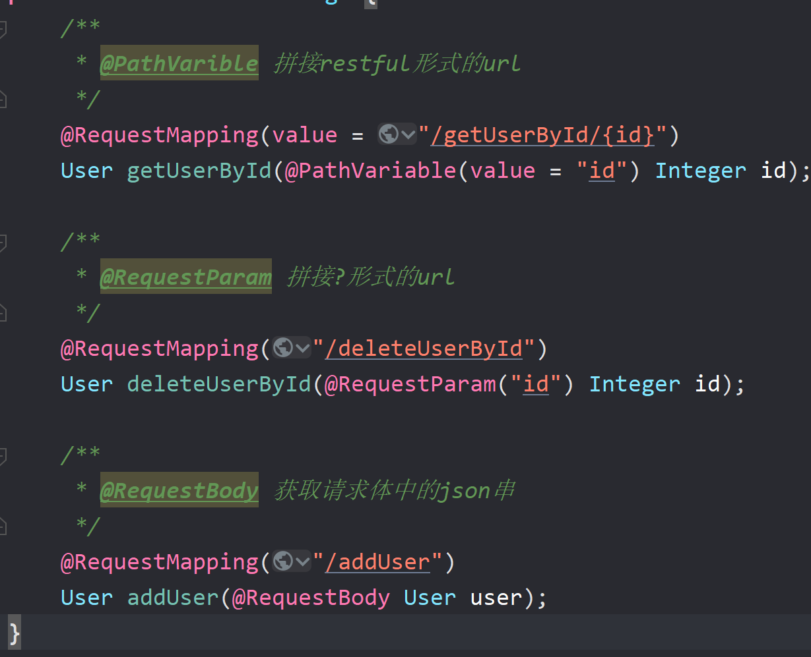
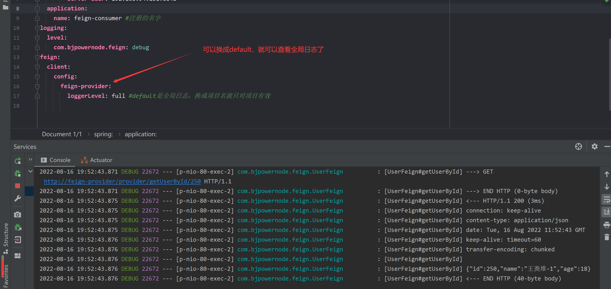
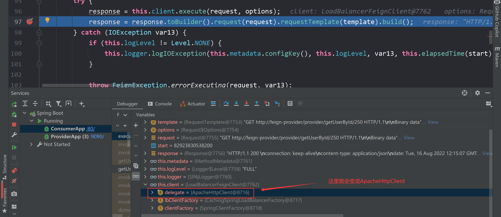
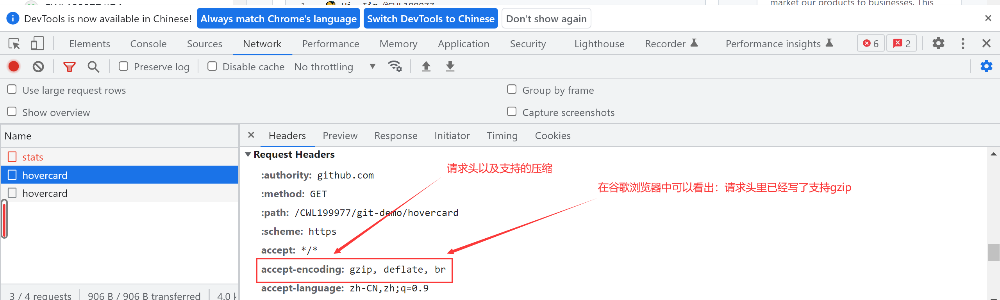
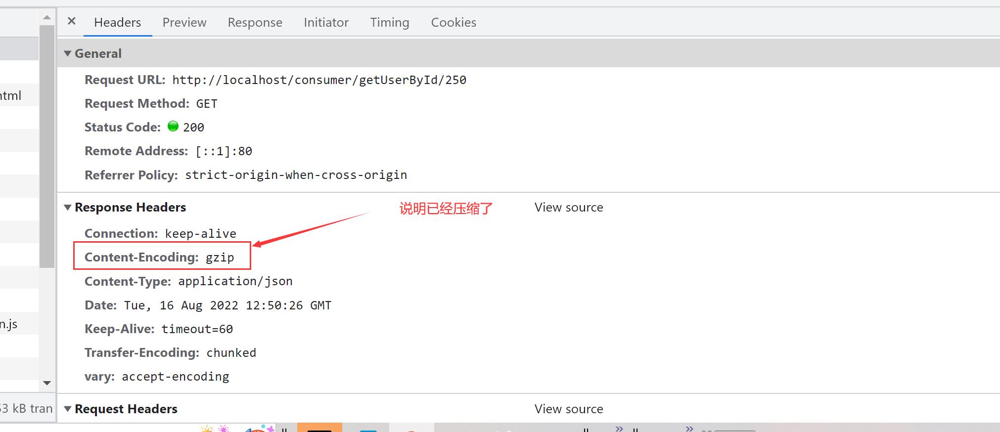

## 声明式服务调用Feign

###  一、feign介绍

> - 什么feign?
>   - feign是spring cloud提供的声明式的http客户端，工作在consumer端
>   - feign支持springmvc注解
>   - feign集成了Ribbon也支持负载均衡
>   - （ribbon+restTemplate)+优化=feign
>
> - feign的启动器
> 	- <!--Spring Cloud OpenFeign Starter -->
        <dependency>
            <groupId>org.springframework.cloud</groupId>
            <artifactId>spring-cloud-starter-openfeign</artifactId>
        </dependency>

### 二、feign入门

### 1.创建服务提供者
#### 1.创建provider工程

`如工程名字叫feign_provider`	

#### 2.在application.yml配置文件里加入：

```yaml
server:
  port: 9090
spring:
  cloud:
    nacos:
      discovery:
        server-addr: 192.168.209.129:8848
  application:
    name: feign-provider
```

### 2.创建feign接口

#### 1.创建interface工程

`如工程名字叫feign_interface`

#### 2.在pom.xml加入依赖：l

```xml

    <dependencies>
        <!--加入Spring Cloud OpenFeign Starter -->
        <dependency>
            <groupId>org.springframework.cloud</groupId>
            <artifactId>spring-cloud-starter-openfeign</artifactId>
        </dependency>
    </dependencies>
```

#### 3.创建Feign接口
**在接口上面加入`@FeignClient(value="feign-providerr",fallbackFactory = UserFeignFallback.class)`注解**

```java
//参数1：是服务名
@FeignClient(value="feign-provider",fallbackFactory = UserFeignFallback.class)
@RequestMapping(value = "/provider")
public interface UserFeign {
    @RequestMapping(value = "/getUserById/{id}")
    public User getUserById(@PathVariable(value="id") Integer id);
}
```
### 3.创建服务消费者

#### 1.创建消费者consumer工程

`如工程名字叫ribbon_consumer`

#### 2.在pom.xml加入依赖：
```xml
        <!--feign接口-->
        <dependency>
            <groupId>com.bjpowernode</groupId>
            <artifactId>feign_interface</artifactId>
            <version>1.0-SNAPSHOT</version>
        </dependency>
```

#### 3.在application.yml配置文件里加入：

```yaml
server:
  port: 80
spring:
  cloud:
    nacos:
      discovery:
        server-addr: 192.168.209.129:8848
  application:
    name: feign-consumer
```

#### 4.创建Controller并且注入Feign接口

```java
@RestController
@RequestMapping(value = "/consumer")
public class ConsumerController {

    @Autowired
    private UserFeign userFeign;

    @RequestMapping(value = "/getUserById/{id}")
    public User getUserById(@PathVariable Integer id) {
        return userFeign.getUserById(id);
    }
}
```

#### 4.在启动类app上
- `加上@EnableFeignClients注解//开启feign接口扫描`

```java
@SpringBootApplication
@EnableDiscoveryClient
//@EnableFeignClients(basePackages = "com.bjpowernode.feign")
@EnableFeignClients//开启feign接口扫描
public class ConsumerApp {

    public static void main(String[] args) {
        SpringApplication.run(ConsumerApp.class);
    }
}
```
### 三、feign原理
> 	- 将feign接口的代理类扫描到Spring容器中：
> 	  - @EnableFeignClients开启feign注解扫描：
> 	    - FeignClientsRegistrar.registerFeignClients()扫描被 @FeignClient标识的接口生成代理类，
> 	      	并把接口和代理类交给Spring的容器管理。
> 	- 为接口的方法创建RequestTemplate
> 	  - 当consumer调用feign代理类时:
> 	    - 代理类会调用SynchronousMethodHandler.invoke()创建RequestTemplate(url，参数)
> 	- 发出请求
> 		- 代理类会通过RequestTemplate创建Request:
> 	  - 然后client(URLConnetct、HttpClient、OkHttp)使用Request发送请求      

### 四、feign接口传参

```java
	1、？传参
		@RequestParam("id")
	2、restful传参
		@PathVariable("id")
	3、pojo
		@RequestBody
```



### 五、feign优化

#### 1.开启feign日志
```yaml
	feign:
	  client:
	    config:
	      default:
		loggerLevel: full #default是全局日志，换成项目名就只对项目有效
	logging:
	  level:
	    com.bjpowernode.feign: debug
```


#### 2.Http 连接池

##### 1.Http 连接池的作用？

> 采用`HTTP`连接池可以节约大量的时间提示吞吐量 ,从而提升效率

##### 2.添加依赖（可以加消费者项目中，也可以加在feign接口项目中）

```xml
<dependency> 
    <groupId>io.github.openfeign</groupId>
    <artifactId>feign-httpclient</artifactId>
</dependency>
```

##### 3. 配置文件中开启（默认是开启的，所以这一步可以省略）

```ruby
feign:
  # 开启 httpclient
  httpclient:
    enabled: true
```



#### 3.gzip压缩

##### 1.gzip压缩的作用？

>- 当 Gzip 压缩到一个纯文本文件时，效果是非常明显的，大约可以减少 70％ 以上的文件大小。
>- 最明显的好处就是可 以加快网页加载的速度。网页加载速度加快的好处不言而喻，除了节省流量，改善用户的浏览体验
>- 可以通过直接读取 gzip 文件来比普通手工抓取 更快地检索网页。 



##### 2. 在项目中（消费者端）启用 gzip 压缩

```bash
server:
  port: 9203
  # 是否开启压缩
  compression:
    enabled: true
    # 配置支持压缩的 MINE TYPE 这个是默认的可以不写
    mime-types: text/html,text/xml,text/plain,application/xml,application/json
```

##### 3. 在 [Feign](https://so.csdn.net/so/search?q=Feign&spm=1001.2101.3001.7020) 服务提供方开启 gzip 压缩

```bash
feign:
  compression:
    request:
      # 开启请求压缩
      enabled: true
      # 配置支持压缩的 MINE TYPE
      mime-types: text/xml,application/xml,application/json
      # 配置压缩数据大小的下限
      min-request-size: 2048
    response:
      # 开启响应压缩
      enabled: true
```

##### 4. 效果

上述配置完成后，发起请求，观察控制台日志：



#### 4.feign超时

##### 方式1：

```yml
ribbon:
  ConnectTimeout: 5000 #请求连接的超时时间  5000为5秒
  ReadTimeout: 5000 #请求处理的超时时间
```

##### 方式2：

```yml
feign:
  client:
    config:
      feign-provider:
        ConnectTimeout: 5000 #请求连接的超时时间  5000为5秒
        ReadTimeout: 5000 #请求处理的超时时间
```

