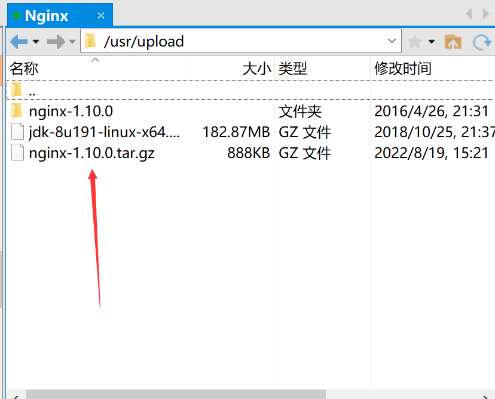
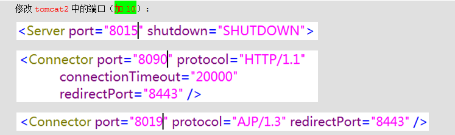
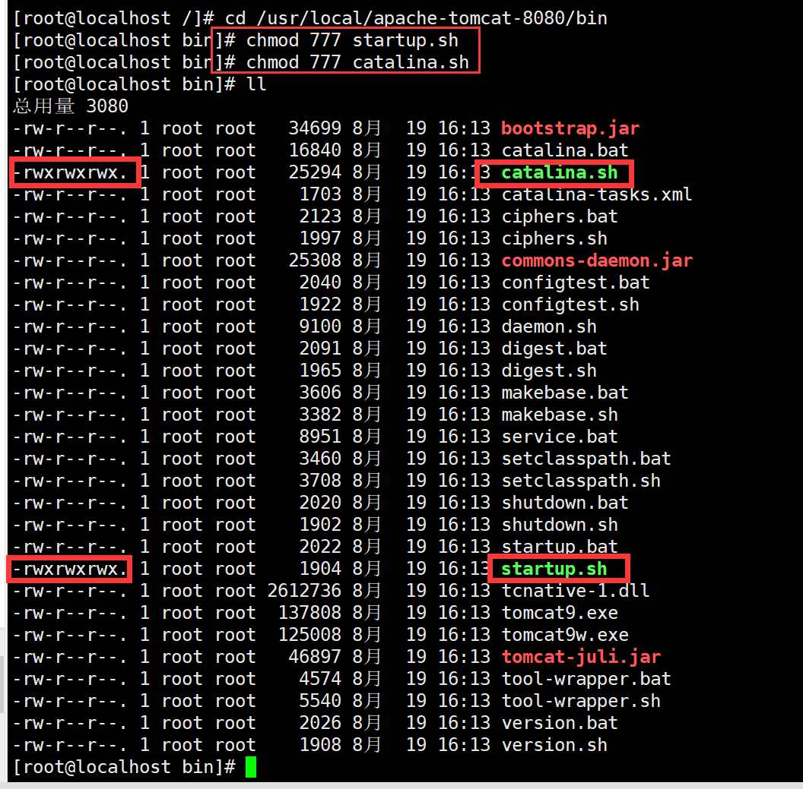
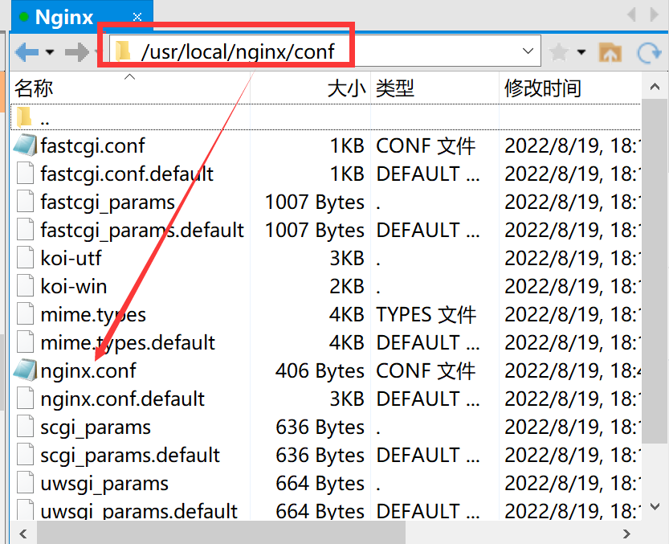
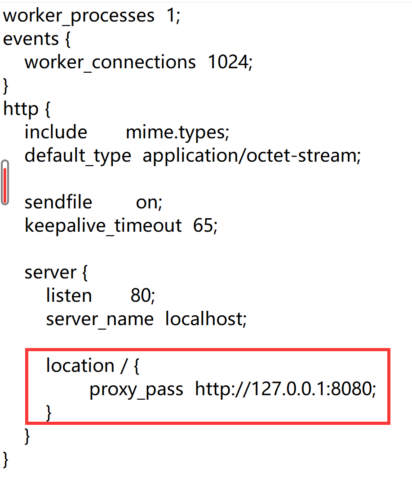
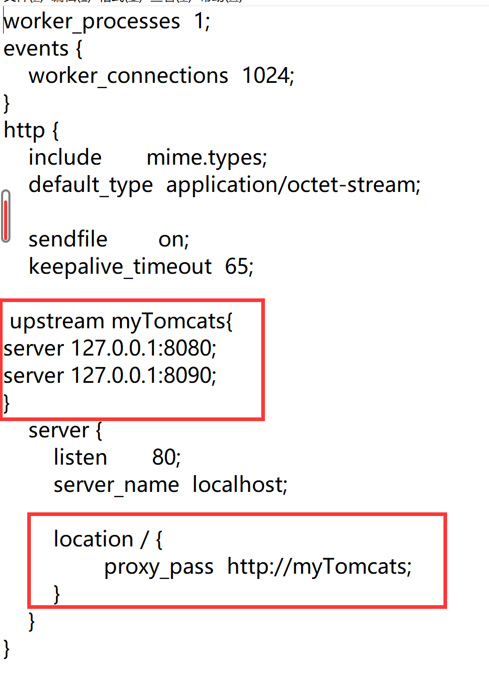

一、nginx介绍

### 1.nginx的作用？
>**反向代理：nginx代替tomcat接收请求**
>**负载均衡：把请求平均分给多台tomcat**
>**动静分离：把项目中的静态资源交给nginx去处理**

## 二、安装nginx
### 1.安装
- 把压缩的安装包放入`/usr/upload`目录下

  

- 安装nginx的依赖库

```shell
yum -y install gcc pcre pcre-devel zlib zlib-devel openssl openssl-devel
```

 

- 解压安装包

```shell
cd /usr/upload
tar -zxvf nginx-1.10.0.tar.gz
```

 

- 配置nginx安装包

```shell
cd nginx-1.10.0

./configure --prefix=/usr/local/nginx
```

**注意**：./configure配置nginx安装到/usr/local/nginx目录下

- 编译并安装

```shell
make && make install
```
### 2.启动和关闭
#### 1.启动

```shell
#在nginx目录下有一个sbin目录，sbin目录下有一个nginx可执行程序
cd /usr/local/nginx/sbin
./nginx
```
#### 2.关闭
```shell
./nginx -s stop
```
#### 3.动态加载配置文件
```shell
#可以不关闭nginx的情况下更新配置文件
cd /usr/local/nginx/sbin
./nginx -s reload
```
#### 4.目录结构
>- conf：配置文件
>- html：静态页面
>- logs：日志
>- sbin：启动脚本


## 三、Nginx代理tomcat 
### 1.在linux中安装两台tomcat

#### 1.解压两个Tomcat

#### 2.修改Tomcat的配置文件，将端口进行修改:

	

#### 3.启动Tomcat

- 先进入他的bin目录

```
cd /usr/local/apache-tomcat-8080/bin
```

- 启动
```java
./startup.sh
```

- **如果遇到没有权限启动就先加权限：**

```
chmod 777 startup.sh

chmod 777 catalina.sh

./startup.sh
```

- 这样就有启动权限了如下图：
 

### 2.反向代理

> **修改nginx/conf/nginx.conf文件：**

```config
  server{
        listen 80;
        server_name localhost;

        location / {
            proxy_pass http://127.0.0.1:8080;
        }
    }
```





### 3.负载均衡

> - **在http节点上添加一个upstream**
>
> - **修改location /下的反向代理**

```config
upstream myTomcats{
    	server 127.0.0.1:8080;
    	server 127.0.0.1:8090;
}
server{
        listen 80;
        server_name localhost;

        location / {
            proxy_pass http://myTomcats;
        }
}
```


### 4.负载均衡产生的问题

#### 1.nginx的6种负载均衡策略？

>- **轮询                         默认**
>- **weight           	      权重**
>- **ip_hash         	    根据ip分配**
>- **url_hash        	   根据url分配**
>- **least_conn      	 最少连接**
>- **fair           	       响应时间**

#### 2.如何防止session丢失？

>- **ip_hash：如果tomcat1挂了，仍然会访问tomcat2**
>-   **session复制：多台tomcat时，复制session非常耗费资源**
>-  **redis：redis和session都是k、V，都能设置过期时间**

#### 5.动静分离

#### 1.配置nginx的nginx.conf

```
  location ~* \.(gif|jpg|png|jpeg)$ {
    		root /usr/upload/images;
    }
```

