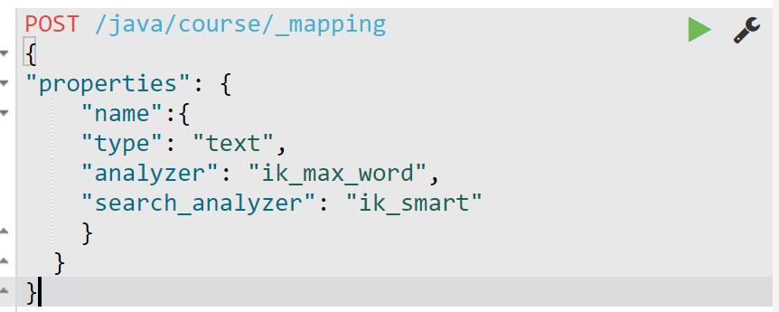

## 一.Field详细介绍

### 1、field数据类型

> - **文本:	text、keyword(往索引目录写不进行分词)**
>
>- **数字:	integer、long、float、double**

### 2、field的属性

> - **type：数据类型，如：text、long**
>- **analyzer：往索引目录写或搜索时的分词模式，如：analyzer=ik_max_word，analyzer=ik_smart**
>- **index：是否往索引目录写，如：true、false**
>- **_source：document中是否存储，如：includes，excludes **

### 3、field属性的设置标注

|    属性     |                       标准                        |
| :---------: | :-----------------------------------------------: |
|  **type**   | **分词是否有意义，（没有意义用keyword如手机号）** |
|  **index**  |      **是否搜索，（默认是true，进行搜索）**       |
| **_source** |    **是否展示，（默认是includes，进行展示）**     |

**注意：如果type：keyword与index：false冲突的话，那么type就用text而index：false不变 **

**下图示例：**

