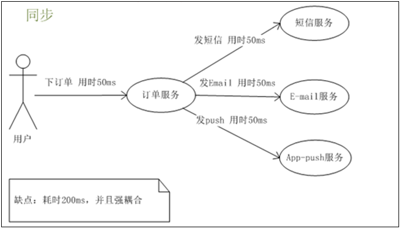
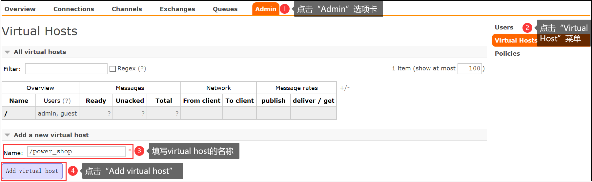

## 1.为什么要使用RabbitMQ ？

### 1.1.解耦

传统模式：系统间耦合性太强，如图所示，系统A在代码中直接调用系统B和系统C的代码，如果将来D系统接入，系统A还需要修改代码，过于麻烦！


中间件模式：将消息写入消息队列，需要消息的系统自己从消息队列中订阅，从而系统A不需要做任何修改。


### 1.2.异步

传统模式: 一些非必要的业务逻辑以同步的方式运行，太耗费时间



中间件模式: 将消息写入消息队列，非必要的业务逻辑以异步的方式运行，加快响应速度


### 1.3.削峰

传统模式：并发量大的时候，所有的请求直接怼到数据库，造成数据库连接异常


中间件模式: 系统A慢慢的按照数据库能处理的并发量，从消息队列中慢慢拉取消息


## 2.安装RabbitMQ

### 2.1.下载

官网下载

地址：http://www.rabbitmq.com/download.html

### 2.2.安装Erlang

上传安装包


依次执行命令:

#### 1.

```java
cd /usr/upload

rpm -ivh esl-erlang-17.3-1.x86_64.rpm --force --nodeps
```

#### 2.

```java
rpm -ivh esl-erlang_17.3-1~centos~6_amd64.rpm --force --nodeps
```

#### 3.

```java
rpm -ivh esl-erlang-compat-R14B-1.el6.noarch.rpm --force --nodeps
```

### 2.3.安装RabbitMQ

上传安装包


#### 2.3.1.安装RabbitMQ

```
rpm -ivh rabbitmq-server-3.4.1-1.noarch.rpm
```


#### 2.3.2.启动、停止

```
service rabbitmq-server start

service rabbitmq-server stop

service rabbitmq-server restart

service rabbitmq-server status
```

#### 2.3.3.设置开机启动

```
chkconfig rabbitmq-server on
```

#### 2.3.4.防火墙开放15672端口

```
/sbin/iptables -I INPUT -p tcp --dport 15672 -j ACCEPT

/etc/rc.d/init.d/iptables save
```

#### 2.3.5.开启web界面管理工具

```
rabbitmq-plugins enable rabbitmq_management

service rabbitmq-server restart
```

 

#### 2.3.6.创建账户

这里我们以创建个admin帐号，密码1111为例，创建一个账号并支持远程ip访问。

1.创建账号

```
rabbitmqctl  add_user admin 1111
```

2.设置用户角色

```
rabbitmqctl  set_user_tags admin  administrator
```

3.设置用户权限

```
rabbitmqctl set_permissions -p "/" admin ".*" ".*" ".*"
```

4.设置完成后可以查看当前用户和角色(需要开启服务)

```
rabbitmqctl list_users
```

	

账号guest具有所有的操作权限，并且又是默认账号，出于安全因素的考虑，guest用户只能通过localhost登陆

### 2.4管理界面

#### 2.4.1.主页总览


connections：无论生产者还是消费者，都需要与RabbitMQ建立连接后才可以完成消息的生产和消费，在这里可以查看连接情况

channels：通道，建立连接后，会形成通道，消息的投递获取依赖通道。

Exchanges：交换机，用来实现消息的路由

Queues：队列，即消息队列，消息存放在队列中，等待消费，消费后被移除队列。


端口：

5672: rabbitMq的编程语言客户端连接端口

15672：rabbitMq管理界面端口

25672：rabbitMq集群的端口

#### 2.4.2.添加用户

如果不使用guest，我们也可以自己创建一个用户：


1、 超级管理员(administrator)

可登陆管理控制台，可查看所有的信息，并且可以对用户，策略(policy)进行操作。

2、 监控者(monitoring)

可登陆管理控制台，同时可以查看rabbitmq节点的相关信息(进程数，内存使用情况，磁盘使用情况等)

3、 策略制定者(policymaker)

可登陆管理控制台, 同时可以对policy进行管理。但无法查看节点的相关信息(上图红框标识的部分)。

4、 普通管理者(management)

仅可登陆管理控制台，无法看到节点信息，也无法对策略进行管理。

5、 其他

无法登陆管理控制台，通常就是普通的生产者和消费者。

 

#### 2.4.3.创建Virtual Hosts

虚拟主机：类似于mysql中的database。他们都是以“/”开头




#### 2.4.4.设置权限

1、点击用户名


2、设置权限

 

3、查看效果


